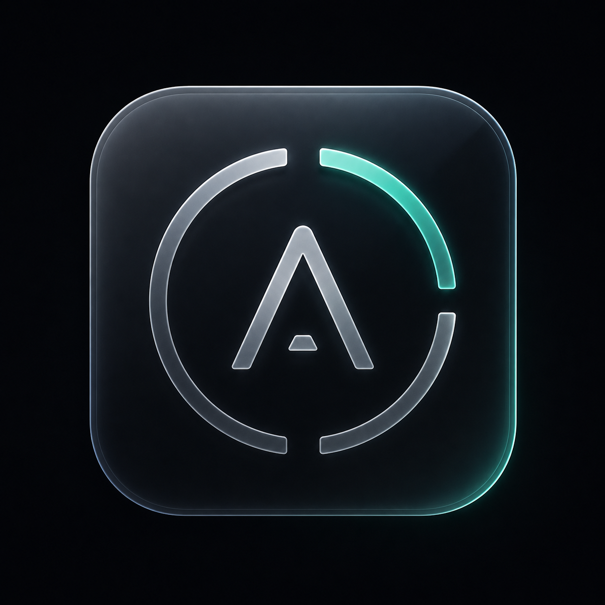
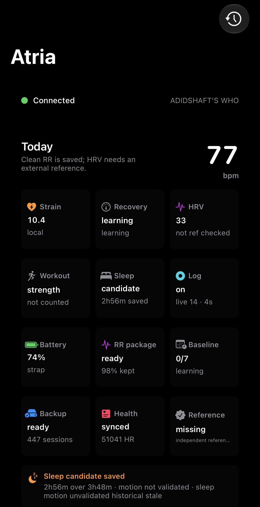

<p align="center">
  
</p>

<h1 align="center">Atria</h1>

<p align="center">
  Free local strap data, for life.
</p>

<p align="center">
  <a href="LICENSE"></a>
  <a href="LICENSE-APACHE"></a>
  
  
  
</p>

<p align="center">
  <a href="#current-status">Status</a>
  ·
  <a href="#quick-start">Quick Start</a>
  ·
  <a href="CONTRIBUTING.md">Contributing</a>
  ·
  <a href="https://x.com/adidshaft">Contact adidshaft</a>
</p>

<p align="center">
  For queries reach out to <a href="https://x.com/adidshaft">adidshaft</a>.
</p>

Atria is an open-source iOS app and BLE research toolkit for using a compatible WHOOP strap locally, without the official WHOOP cloud, account, subscription, or app. It is designed for people who own unused straps and want honest local metrics: live heart rate, saved RR windows, strain, sleep/workout evidence, HealthKit export, and protocol research.

This project is independent and unaffiliated with WHOOP. It does not bypass paid cloud features. It talks to your own hardware over Bluetooth LE and keeps data on device.

<p align="center">
  
</p>

## Current Status

Atria is usable for local backup and honest diagnostics on a physical iPhone. For the current single-strap build, personal baseline is the end-user ready HRV/recovery state; external-reference validation remains an optional/internal gate for HealthKit HRV and research claims, not a required user task.

| Gate | Area | Status | What works | What remains |
|---|---|---:|---|---|
| A | BLE connection and live collection | Partial | Fresh scan/connect, standard `2A37` HR, battery, long-wear logging, reconnect watchdogs | Proprietary realtime stream remains diagnostic; custom RR stream is not reliable enough to be primary |
| B | HRV | Personal baseline | Clean saved 5-minute RR window exists; RMSSD is shown with an honest personal-baseline/unverified badge; RR correction/confidence enforced | Real-device single-strap self-consistency and coverage evidence |
| C | Recovery | Personal baseline | Recovery appears once local HRV and resting baselines are mature, with a personal-baseline/unverified confidence state | More real-device baseline maturity and long-wear coverage proof |
| D | Strain and onboarding | Partial | HR-reserve TRIMP, learned resting HR, HRmax/profile controls, explainable strain | Workout-intensity calibration from real sustained captures |
| E | Sleep and workout detection | User-confirmed evidence | Sleep/workout candidates, user-confirmed examples, daily rollups, honest blockers | Fully automatic workout detection from cleaner sustained coverage |
| F | Trends and insights | Local progress | 7/30/90-day trend surfaces and anomaly routing from saved rollups | More real saved history and baseline-backed trend confidence |
| G | Platform polish | Metric-gated | HealthKit HR/workout/sleep export, backups, notifications, widget/complication plumbing | HealthKit HRV write waits for validated HRV |
| H | Protocol expansion | Research-ready | Historical/archive decoder evidence and protocol diagnostics | Additional sensor validation and broader strap-history decoding |

## Principles

- **Local first:** no WHOOP account, no cloud dependency, no subscription requirement.
- **No fake metrics:** HRV and recovery stay learning until real local RR/baseline evidence is sufficient, then appear as personal-baseline/unverified. Validated remains an internal/export tier, not a default user promise.
- **Physical-device verified:** BLE work must be tested on a real iPhone; the Simulator does not count.
- **Explainable outputs:** metrics expose source, confidence, and blockers instead of hiding uncertainty.
- **Conservative by default:** when data is missing, gappy, or unvalidated, Atria reports that clearly.

## What Works Today

- Physical iPhone BLE collection from a compatible strap.
- Live heart rate via standard BLE Heart Rate Measurement (`0x2A37`).
- Battery readout.
- Long-wear foreground backup with checkpointing.
- Saved RR window detection with artifact filtering:
  - keep RR intervals in `300...2000 ms`
  - drop intervals with `>20%` beat-to-beat delta
  - report confidence as kept/raw RR percentage
- Local strain from personalized HR-reserve TRIMP.
- Sleep and workout candidate summaries with explicit blockers.
- HealthKit export for supported validated/local-safe data; HealthKit HRV remains gated on validated SDNN.
- Widget/complication data plumbing.
- Protocol research tools for BLE backup and frame analysis.

## What Does Not Work Yet

- Clinically validated HRV. Atria can show local RMSSD as a personal baseline; independent RR/IBI validation is not part of the single-strap user path.
- Fully validated recovery. Recovery can display as a personal baseline; the validated tier stays gated for export/research uses.
- Fully automatic workout detection in all gym conditions. Current logic is honest about stream coverage and HR-intensity blockers.
- Any claim that requires WHOOP cloud data. This project intentionally stays local.

## Quick Start

Requirements:

- macOS with Xcode.
- A physical iPhone. BLE collection cannot be validated in the Simulator.
- A compatible strap that is free to advertise over BLE.
- Apple Developer signing configured for the iOS app target.

Build and run:

```sh
open WhoopApp/WhoopApp.xcodeproj
```

Select the Atria app target, choose your physical iPhone, set signing if needed, and run.

For command-line physical-device verification:

```sh
./live_device_debug.sh --seconds 45 --log logs/live-device/run.log --log-gate-status --standard-hr-only --long-wear-mode --leave-running
```

Fast local tooling checks:

```sh
./test_handoff_local.sh
```

Long-wear acceptance, when extended physical-device checks are allowed:

```sh
ATRIA_DEVICE_ID=<physical-device-id> \
  python3 tools/monitor_long_wear.py \
  --preset overnight \
  --label overnight-$(date -u +%Y%m%dT%H%M%SZ)
```

That monitor is non-invasive: it uses `live_device_debug.sh --pull-only` to sample
sessions and the active journal without relaunching Atria. The handoff is not
accepted until the final summary reports `acceptance_status=pass` and
`acceptance_blockers=none`, and the handoff audit confirms the summary is the
full overnight shape rather than a short custom smoke.

Accessibility/performance acceptance also needs a physical iPhone 15 Pro
manifest. Start from `docs/evidence/accessibility-performance/summary.template.json`
and fill it only from measured device results.

To summarize the current handoff evidence without running the device:

```sh
python3 tools/audit_handoff_status.py --skip-external-reference
```

After overnight and accessibility/performance evidence exists:

```sh
python3 tools/audit_handoff_status.py \
  --skip-external-reference \
  --summary <overnight-summary.json> \
  --accessibility-performance <accessibility-performance-summary.json>
```

## Repository Layout

| Path | Purpose |
|---|---|
| `WhoopApp/` | Native SwiftUI iOS app, widget, HealthKit, BLE, and local metrics code. |
| `tools/` | Analysis helpers for captures, references, and protocol evidence. |
| `docs/` | Technical notes, gate plans, evidence summaries, and protocol research. |
| `scan.py`, `probe.py`, `listen.py`, `whoop_codec.py` | macOS BLE exploration and decode tooling. |
| `live_device_debug.sh` | Physical-iPhone build/install/launch/log harness. |
| `assets/` | Logo and README screenshots. |

## Contributing

The fastest useful contributions are:

- Improve BLE reliability without increasing radio traffic.
- Add tests around RR parsing, correction, and confidence gates.
- Improve workout detection from real saved sessions.
- Decode additional historical/protocol payloads with evidence.
- Improve docs for setup and troubleshooting.

Before opening a PR, read [CONTRIBUTING.md](CONTRIBUTING.md). Do not submit code that estimates HRV from HR-only data or silently promotes low-confidence metrics.

## Safety and Privacy

Atria is not medical software. It is a local research and personal-fitness project. Do not use it for diagnosis, treatment, or safety-critical decisions.

The app is designed to keep data local. Be careful when sharing logs or evidence files; they may contain timestamps, heart-rate samples, device names, and workout/sleep patterns.

## License

Dual licensed under MIT or Apache-2.0. See [LICENSE](LICENSE) and [LICENSE-APACHE](LICENSE-APACHE).
