<p align="center">
  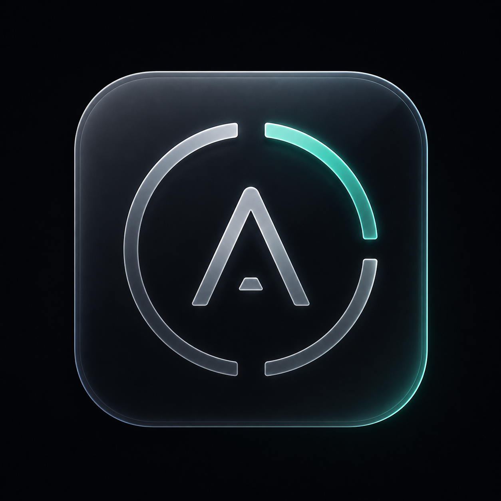
</p>

<h1 align="center">Atria</h1>

<p align="center">
  Free local strap data, for life.
</p>

<p align="center">
  <a href="LICENSE"></a>
  <a href="LICENSE-APACHE"></a>
  
  
  
</p>

<p align="center">
  <a href="#current-status">Status</a>
  ·
  <a href="#quick-start">Quick Start</a>
  ·
  <a href="docs/SETUP.md">Setup Guide</a>
  ·
  <a href="docs/README.md">Docs</a>
  ·
  <a href="CONTRIBUTING.md">Contributing</a>
  ·
  <a href="https://x.com/adidshaft">Contact adidshaft</a>
</p>

<p align="center">
  For queries reach out to <a href="https://x.com/adidshaft">adidshaft</a>.
</p>

Atria is an open-source iOS app and BLE research toolkit for using a compatible WHOOP strap locally, without the official WHOOP cloud, account, subscription, or app. It is designed for people who own unused straps and want honest local metrics: live heart rate, saved RR windows, strain, sleep/workout evidence, HealthKit export, and protocol research.

This project is independent and unaffiliated with WHOOP. It does not bypass paid cloud features. It talks to your own hardware over Bluetooth LE and keeps data on device.

## App Tour

<p align="center">
  <a href="assets/screenshots/atria-today-overview.png">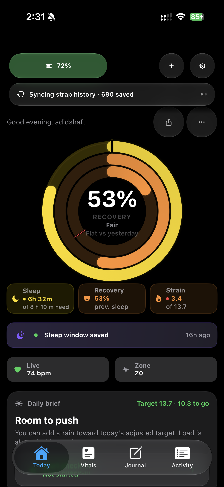</a>
  <a href="assets/screenshots/atria-today-glance.png">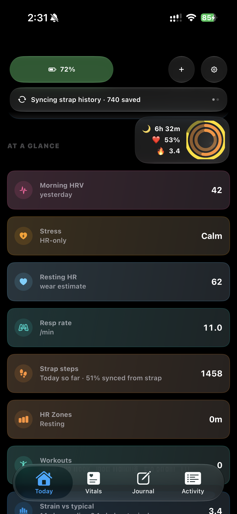</a>
  <a href="assets/screenshots/atria-vitals-live.png">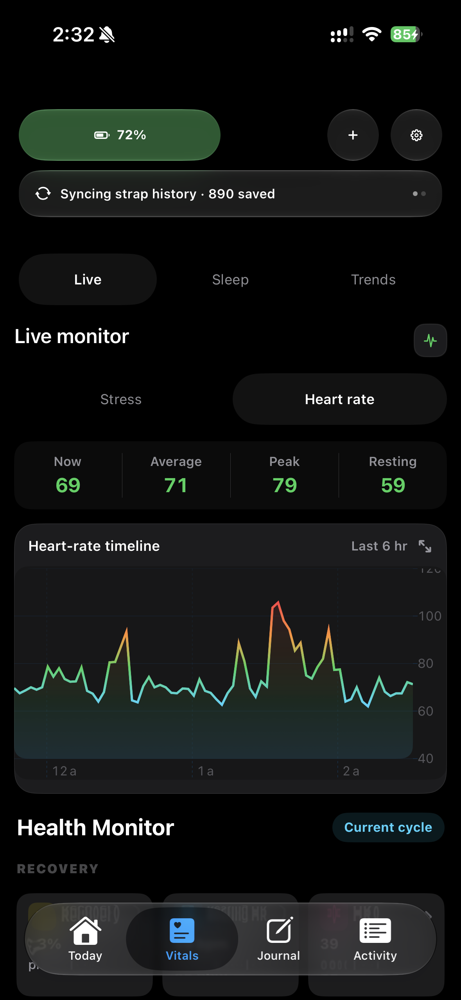</a>
  <a href="assets/screenshots/atria-vitals-overview.png">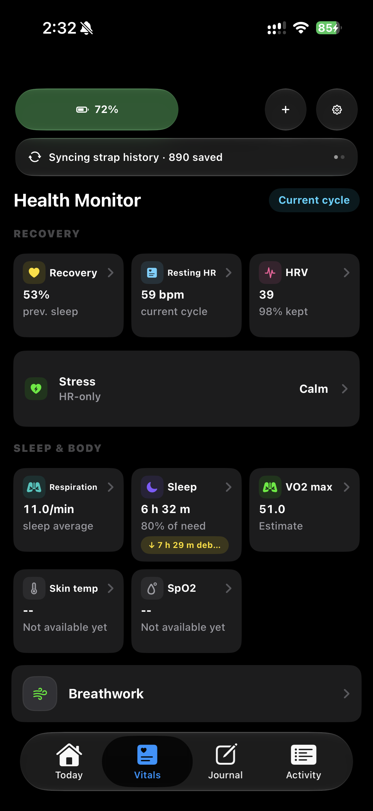</a>
</p>

<p align="center">
  <a href="assets/screenshots/atria-hrv-trends.png">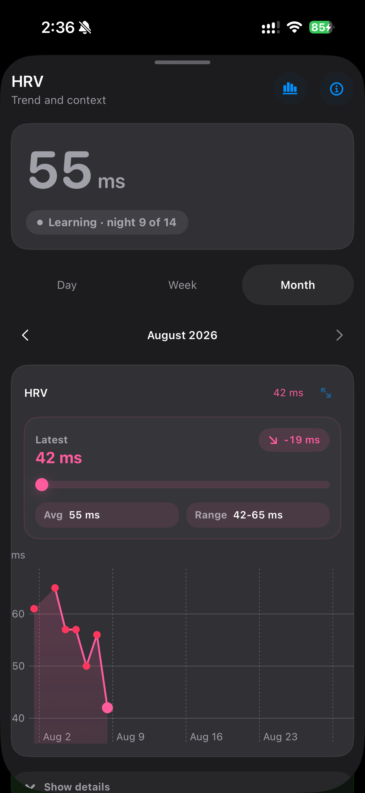</a>
  <a href="assets/screenshots/atria-journal-insights.png">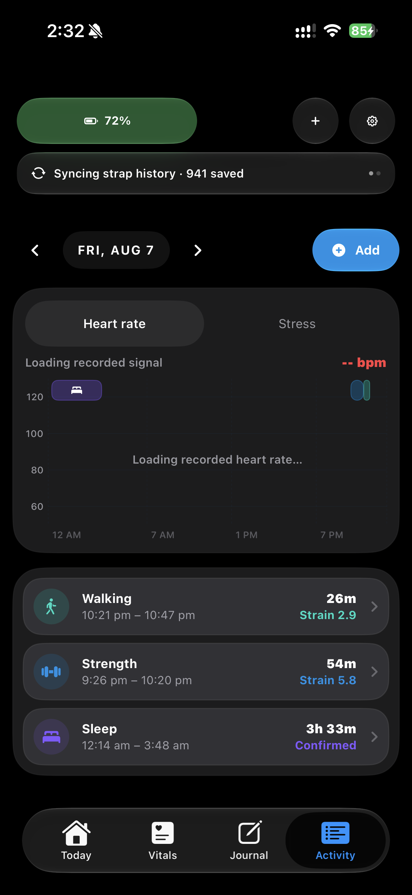</a>
  <a href="assets/screenshots/atria-activity-timeline.png">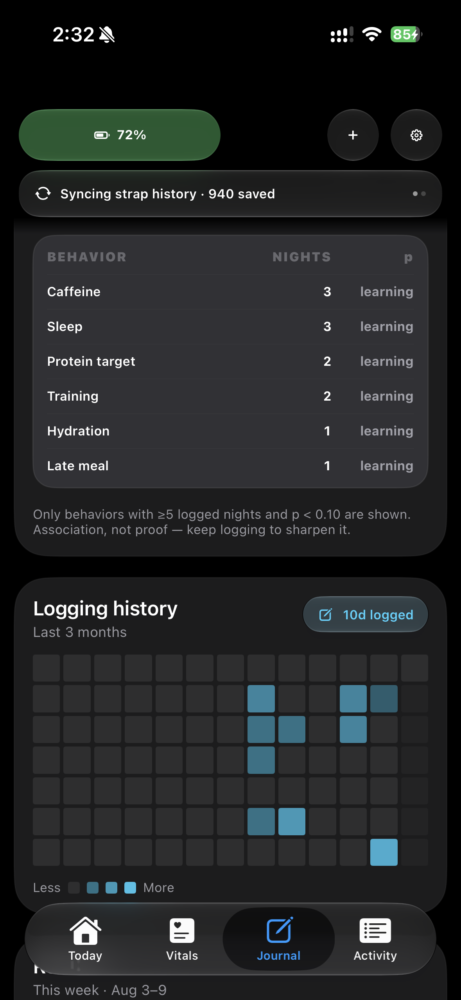</a>
</p>

<p align="center">
  <a href="assets/screenshots/atria-workout-setup.png">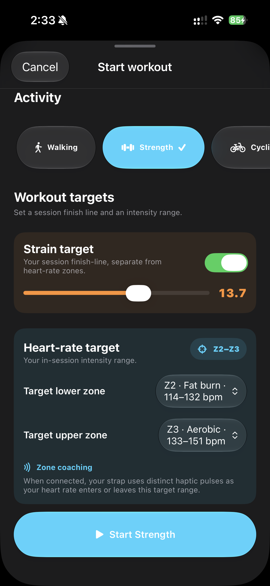</a>
  <a href="assets/screenshots/atria-activity-picker.png">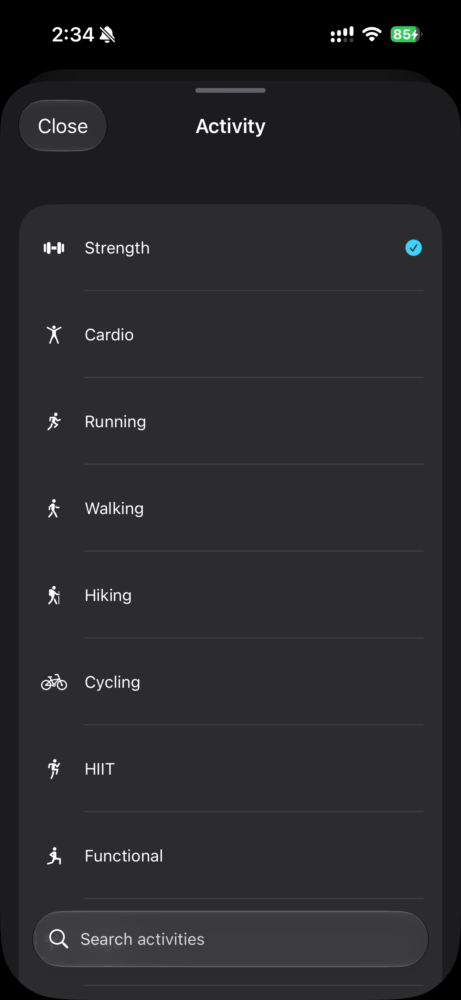</a>
  <a href="assets/screenshots/atria-live-workout.png">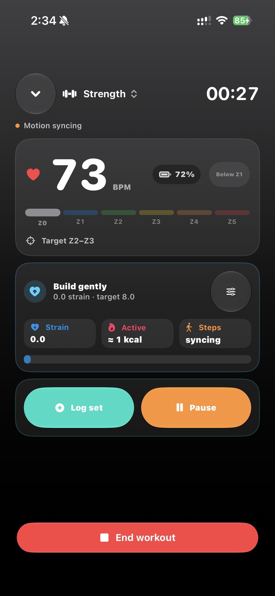</a>
</p>

<p align="center">
  <a href="assets/screenshots/atria-workout-summary.png">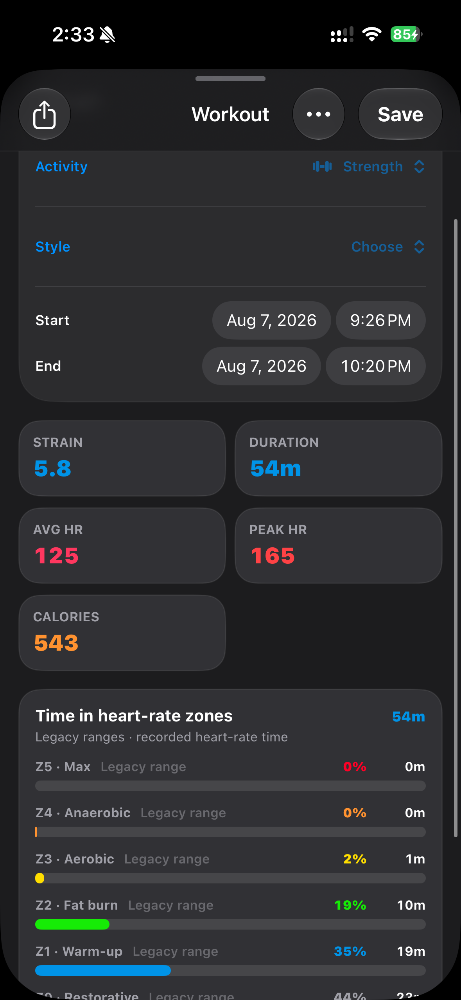</a>
  <a href="assets/screenshots/atria-breathwork.png">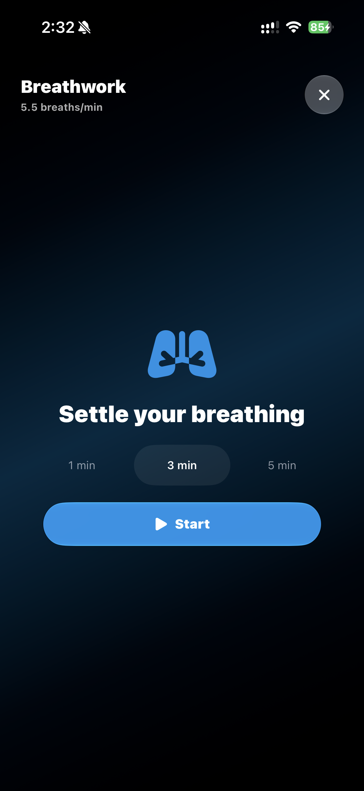</a>
  <a href="assets/screenshots/atria-metric-customization.png">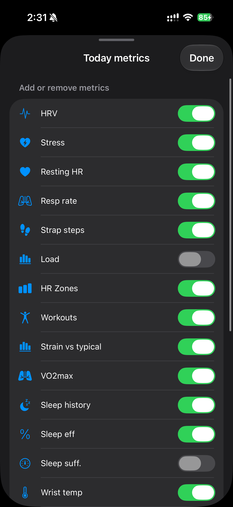</a>
</p>

## Current Status

**Status reviewed 23 September 2026.** The public default branch, published
`dev`, and latest local research are at different checkpoints. See
[Current product status](docs/CURRENT_STATUS.md) for the branch boundaries,
active issues, and acceptance gates. The new Mac R10/R11 findings are not yet
an enabled iPhone feature or a released build.

Atria is usable for local backup and honest diagnostics on a physical iPhone. For the current single-strap build, personal baseline is the end-user ready HRV/recovery state; external-reference validation remains an optional/internal gate for HealthKit HRV and research claims, not a required user task.

### At a glance

**✅ Implemented** · **🟡 Limited confidence** · **🔬 Research only** · **⏳ Pending** · **⛔ Blocked**

“Implemented” describes working functionality, not independently validated health
accuracy. Status includes development work; the branch boundaries above still
apply. Confidence labels are evidence categories, not completion percentages.

| Capability | Achieved | Confidence / availability | Next milestone |
|---|---|---|---|
| **Live HR, battery & local data** | iPhone collection, persistence and reconnect handling | ✅ Implemented; background acceptance remains | [Fresh onboarding](https://github.com/adidshaft/atria/issues/23) · [lease expiration](https://github.com/adidshaft/atria/issues/22) |
| **HRV & recovery** | RR filtering, RMSSD and personal baselines | 🟡 Personal baseline; reference-unverified | [Resolve RR scaling](https://github.com/adidshaft/atria/issues/47) · [qualify recovery](https://github.com/adidshaft/atria/issues/2) |
| **Strain** | Personalized HR-reserve TRIMP | 🟡 Local estimate; calibration pending | [Rest/high-effort reference comparison](https://github.com/adidshaft/atria/issues/3) |
| **Sleep & workouts** | Candidates, saved sessions and daily summaries | 🟡 Coverage-dependent; review flow needs proof | [Physical sleep review](https://github.com/adidshaft/atria/issues/25) · [workout surfaces](https://github.com/adidshaft/atria/issues/45) |
| **Trends, widgets & insights** | Local history views and shared display data | 🟡 Cross-surface consistency still under review | [Trend confidence](https://github.com/adidshaft/atria/issues/5) · [concise UI](https://github.com/adidshaft/atria/issues/48) |
| **All-day steps** | Mac fused estimator; development-build count display | 🔬 All-day accuracy unproven | [Held-out walks, controls and gap coverage](https://github.com/adidshaft/atria/issues/21) |
| **R10/R11 motion & optical streams** | Mac decoding and offline Swift port | 🔬 Local research; production iPhone path disabled | [Sustained iPhone integration](https://github.com/adidshaft/atria/issues/46) |
| **Disconnect recovery** | Short Mac test recovered contiguous 1 Hz history | 🔬 Long-gap/iPhone proof pending; raw high-rate gaps remain lost | [Overnight analysis and lifecycle checks](https://github.com/adidshaft/atria/issues/46) |
| **Skin temperature** | Thermal candidates; one R10 reference point | 🟡 Preliminary; absolute calibration unproven | [Repeated references and baseline stability](https://github.com/adidshaft/atria/issues/31) |
| **SpO₂** | Pulsatile R11 optical data decoded on Mac | ⏳ No defensible percentage yet | [Channel/gain interpretation and reference validation](https://github.com/adidshaft/atria/issues/31) |
| **HealthKit** | Supported HR/workout/sleep export plumbing | ✅ Implemented for supported data; HRV export gated | [Qualified HRV and device readback](https://github.com/adidshaft/atria/issues/6) |
| **Integration & release** | Draft integration PR and local device builds | ⛔ Verification and distribution gates open | [Repair checks](https://github.com/adidshaft/atria/issues/44) · [TestFlight receipt](https://github.com/adidshaft/atria/issues/42) |

### From working data to trusted features

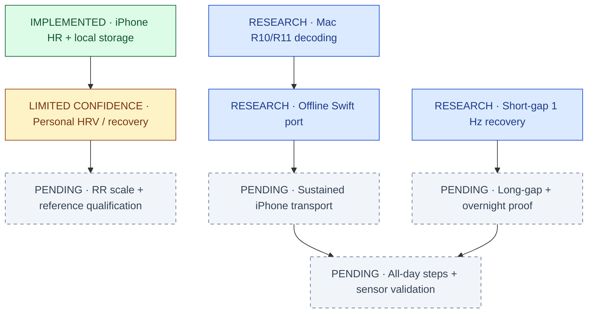
```mermaid
flowchart TD
    A["IMPLEMENTED · iPhone HR + local storage"] --> B["LIMITED CONFIDENCE · Personal HRV / recovery"]
    B --> C["PENDING · RR scale + reference qualification"]
    D["RESEARCH · Mac R10/R11 decoding"] --> E["RESEARCH · Offline Swift port"]
    E --> F["PENDING · Sustained iPhone transport"]
    G["RESEARCH · Short-gap 1 Hz recovery"] --> H["PENDING · Long-gap + overnight proof"]
    F --> I["PENDING · All-day steps + sensor validation"]
    H --> I
    classDef implemented fill:#dcfce7,stroke:#166534,color:#14532d
    classDef limited fill:#fef3c7,stroke:#92400e,color:#78350f
    classDef research fill:#dbeafe,stroke:#1d4ed8,color:#1e3a8a
    classDef pending fill:#f1f5f9,stroke:#64748b,color:#334155,stroke-dasharray:5 5
    class A implemented
    class B limited
    class D,E,G research
    class C,F,H,I pending
```

Solid boxes describe existing functionality or research results; dashed boxes
are unfinished milestones. The paths show dependencies, not a release timeline.
See the [full status and issue index](docs/CURRENT_STATUS.md) for acceptance criteria.

## Principles

- **Local first:** no WHOOP account, no cloud dependency, no subscription requirement.
- **No fake metrics:** HRV and recovery stay learning until real local RR/baseline evidence is sufficient, then appear as personal-baseline/unverified. Validated remains an internal/export tier, not a default user promise.
- **Physical-device verified:** BLE work must be tested on a real iPhone; the Simulator does not count.
- **Explainable outputs:** metrics expose source, confidence, and blockers instead of hiding uncertainty.
- **Conservative by default:** when data is missing, gappy, or unvalidated, Atria reports that clearly.

## What Works Today

- Physical iPhone BLE collection from a compatible strap.
- Live heart rate via standard BLE Heart Rate Measurement (`0x2A37`).
- Battery readout.
- Long-wear foreground backup with checkpointing.
- Saved RR window detection with artifact filtering:
  - keep RR intervals in `300...2000 ms`
  - drop intervals with `>20%` beat-to-beat delta
  - report confidence as kept/raw RR percentage
- Local strain from personalized HR-reserve TRIMP.
- Sleep and workout candidate summaries with explicit blockers.
- HealthKit export for supported validated/local-safe data; HealthKit HRV remains gated on validated SDNN.
- Widget/complication data plumbing.
- Protocol research tools for BLE backup and frame analysis.

## What Does Not Work Yet

- Clinically validated HRV. Atria can show local RMSSD as a personal baseline; independent RR/IBI validation is not part of the single-strap user path.
- Fully validated recovery. Recovery can display as a personal baseline; the validated tier stays gated for export/research uses.
- Fully automatic workout detection in all gym conditions. Current logic is honest about stream coverage and HR-intensity blockers.
- **Validated whole-day steps.** Development builds have displayed step totals,
  but display agreement does not establish all-day accuracy. September 23 Mac
  experiments recovered 1 Hz history across a short disconnect and exercised a
  fused step estimator. Fresh held-out walks, long gaps, and physical iPhone
  integration remain open. Raw high-rate IMU is not stored during disconnects.
  ([#21](https://github.com/adidshaft/atria/issues/21),
  [#46](https://github.com/adidshaft/atria/issues/46))
- **SpO₂.** Historical V24 DC candidate fields did not support a defensible
  percentage. Newly decoded Mac R11 pulsatile optical data is a separate
  research source, not a validated SpO₂ value.
  ([#31](https://github.com/adidshaft/atria/issues/31))
- **Calibrated absolute skin temperature.** The older V24 thermal signal and
  the new R10 candidate have different evidence. R10 has one contact-thermometer
  comparison; repeatability, slope and per-device calibration are unproven.
  The product target remains deviation from a personal baseline.
- **Confirmed WHOOP-specific RR scaling.** Mac source comparisons found a
  discrepancy with the app's standard Heart Rate Service conversion. A
  source-specific investigation is pending; independent HRV and HealthKit
  validation gates remain unchanged.
  ([#47](https://github.com/adidshaft/atria/issues/47))
- Any claim that requires WHOOP cloud data. This project intentionally stays local.

## Quick Start

Requirements:

- macOS with Xcode.
- A physical iPhone running iOS 26.1 or later. BLE collection cannot be validated in the Simulator.
- A compatible strap that is free to advertise over BLE.
- Apple Developer signing configured for the iOS app target.

Build and run:

```sh
open Atria/Atria.xcodeproj
```

Select the Atria app target, choose your physical iPhone, set signing if needed, and run.

> **New to the project?** [`docs/SETUP.md`](docs/SETUP.md) covers signing, the
> device-log harness, the errors you will actually hit, and which logs are safe
> to share before you post evidence anywhere.

For command-line physical-device verification:

```sh
ATRIA_DEVICE_ID="YOUR-PHYSICAL-DEVICE-ID" ./live_device_debug.sh --seconds 45 --log logs/live-device/run.log --log-gate-status --standard-hr-only --long-wear-mode --leave-running
```

Local tooling checks (offline; the current development static gate has known
failures tracked in [#44](https://github.com/adidshaft/atria/issues/44)):

```sh
./test_handoff_local.sh
```

Long-wear acceptance, when extended physical-device checks are allowed:

```sh
ATRIA_DEVICE_ID="YOUR-PHYSICAL-DEVICE-ID" \
  python3 tools/monitor_long_wear.py \
  --preset overnight \
  --label overnight-$(date -u +%Y%m%dT%H%M%SZ)
```

That monitor is non-invasive: it uses `live_device_debug.sh --pull-only` to sample
sessions and the active journal without relaunching Atria. The handoff is not
accepted until the final summary reports `acceptance_status=pass` and
`acceptance_blockers=none`, and the handoff audit confirms the summary is the
full overnight shape rather than a short custom smoke.

Accessibility/performance acceptance also needs measured physical-device
results. Capture them with `tools/capture_accessibility_visual_evidence.sh` and
`tools/capture_dashboard_scroll_performance.sh`, then create the local manifest
with `tools/prepare_accessibility_performance_evidence.py`.

To summarize the current handoff evidence without running the device:

```sh
python3 tools/audit_handoff_status.py --skip-external-reference
```

After overnight and accessibility/performance evidence exists:

```sh
python3 tools/audit_handoff_status.py \
  --skip-external-reference \
  --summary <overnight-summary.json> \
  --accessibility-performance <accessibility-performance-summary.json>
```

## Repository Layout

| Path | Purpose |
|---|---|
| `Atria/` | Native SwiftUI iOS app, widget, HealthKit, BLE, and local metrics code. |
| `tools/` | Analysis helpers for captures, references, and protocol evidence. |
| `docs/` | Technical notes, validation plans, and protocol research — start at [`docs/README.md`](docs/README.md). |
| `scan.py`, `probe.py`, `listen.py`, `whoop_codec.py` | macOS BLE exploration and decode tooling. |
| `live_device_debug.sh` | Physical-iPhone build/install/launch/log harness. |
| `test_*.py`, `test_*.sh` | Offline regression checks and evidence harnesses; physical capture scripts require a device. |
| `gate_*.sh`, `reference_*.sh` | Capture and reference-comparison runs for sensor validation. |
| `assets/` | Logo and README screenshots. |
| `evidence/` | Physical-device evidence trees. Gitignored — may contain personal health data. |

Nothing in this repository needs credentials to build. The only local secrets
are your own Apple signing settings, and `.gitignore` keeps signing material,
device evidence, and logs out of version control.

- [Research validation corpus](docs/research-validation-corpus.md) — the rules and fixtures used for reproducible sensor validation.

## Contributing

The fastest useful contributions are:

- Improve BLE reliability without increasing radio traffic.
- Add tests around RR parsing, correction, and confidence gates.
- Improve workout detection from real saved sessions.
- Decode additional historical/protocol payloads with evidence.
- Improve docs for setup and troubleshooting.

Start with [`docs/SETUP.md`](docs/SETUP.md) to get a build running, then browse
[open issues](https://github.com/adidshaft/atria/issues) — they are labelled by
area (`area: ble`, `area: sleep`, `area: steps`…), by type, and by what each one
is waiting on (`needs: device proof`, `needs: reference`, `blocked`).

Before opening a PR, read [CONTRIBUTING.md](CONTRIBUTING.md). Do not submit code that estimates HRV from HR-only data or silently promotes low-confidence metrics.

## Safety and Privacy

Atria is not medical software. It is a local research and personal-fitness project. Do not use it for diagnosis, treatment, or safety-critical decisions.

The app is designed to keep data local. Be careful when sharing logs or evidence files; they may contain timestamps, heart-rate samples, device names, and workout/sleep patterns.

## License

Dual licensed under MIT or Apache-2.0. See [LICENSE](LICENSE) and [LICENSE-APACHE](LICENSE-APACHE).
