<p align="center">
  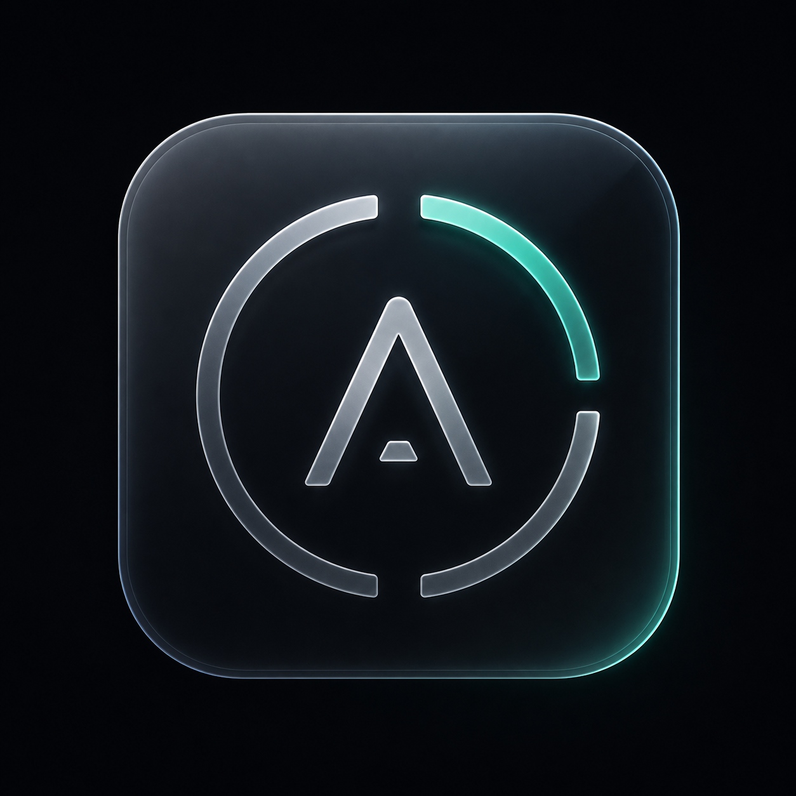
</p>

<h1 align="center">Atria</h1>

<p align="center">
  <b>Your unused strap. Your iPhone. Your choice.</b><br>
  An independent, open-source fitness app for a WHOOP 4.0 you already own, with local processing on your phone.
</p>

<p align="center">
  <a href="LICENSE"></a>
  
  
  <a href="#help-make-atria-accurate"></a>
</p>

<p align="center">
  <a href="#what-you-get">Features</a> ·
  <a href="#how-accurate-is-it">Accuracy</a> ·
  <a href="#help-make-atria-accurate">Help validate</a> ·
  <a href="#quick-start">Quick start</a> ·
  <a href="docs/README.md">Docs</a> ·
  <a href="https://x.com/adidshaft">@adidshaft</a>
</p>

---

Got an unused WHOOP 4.0 in a drawer? Atria is an optional way to explore its signals:
live heart rate, sleep, recovery, strain, steps and more, computed on your
iPhone. No WHOOP account, no cloud, no subscription.

> Independent project, not affiliated with or endorsed by WHOOP. Use with
> hardware you own is voluntary; Atria does not require replacing the official
> app or services and does not claim to be better than them. Strap data is
> processed locally and the developer cannot remotely access it. Atria provides
> fitness estimates; seek a doctor's advice before making medical decisions.

<p align="center">
  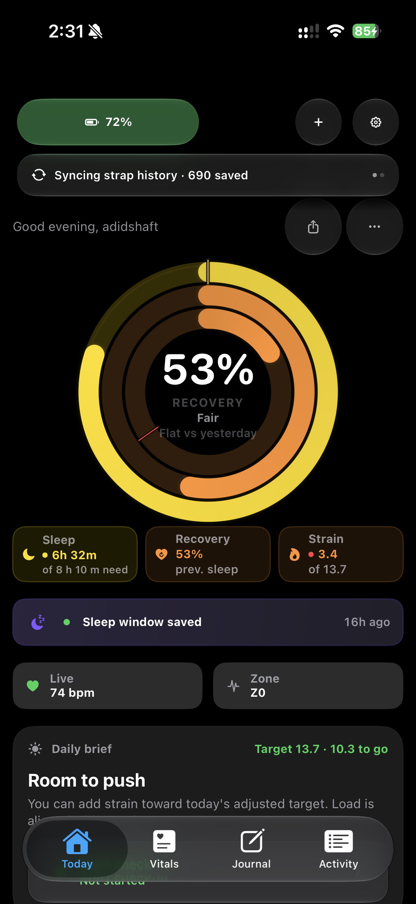
  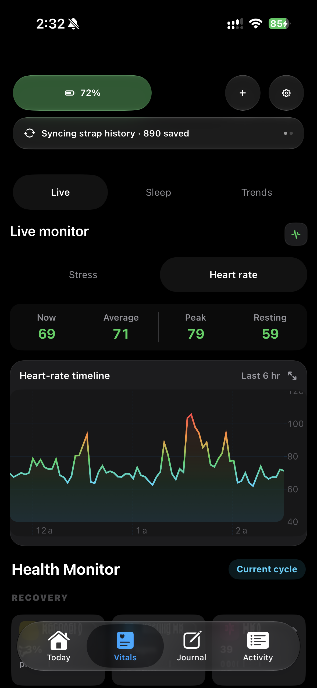
  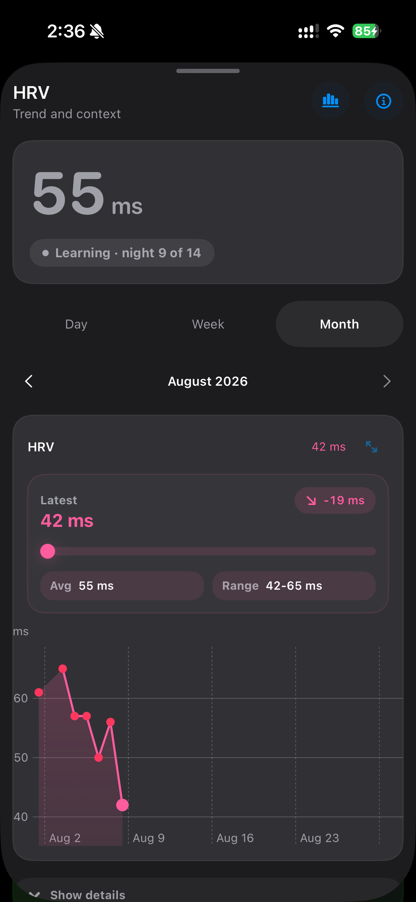
  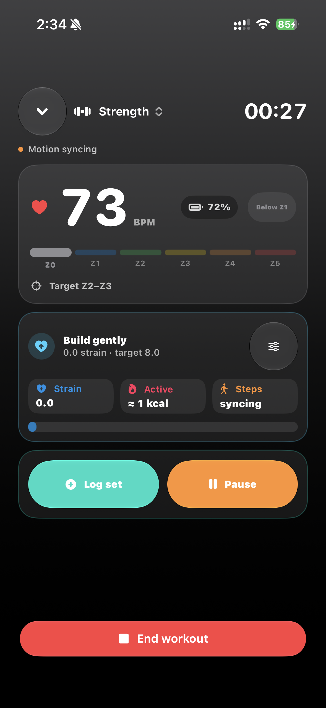
</p>

<details>
<summary><b>More screenshots</b></summary>
<br>
<p align="center">
  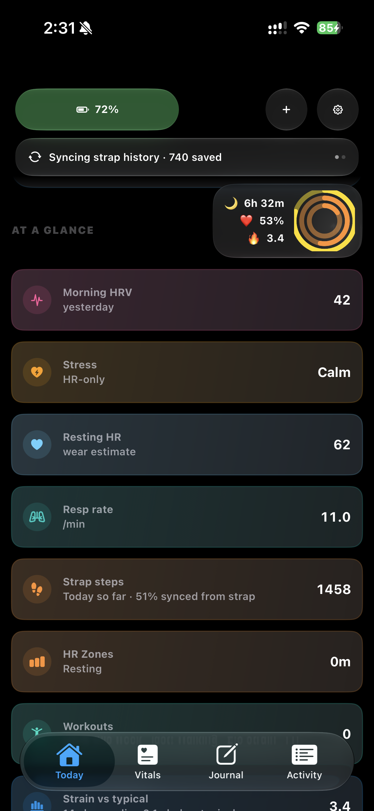
  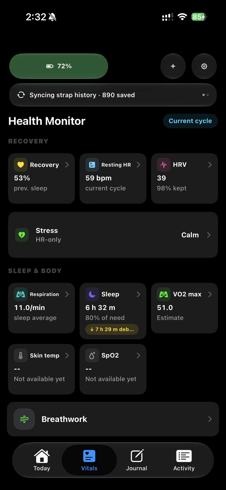
  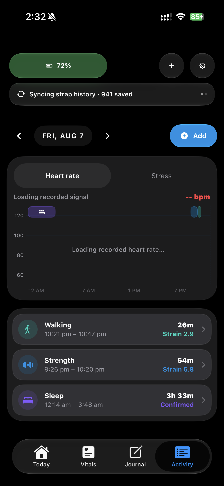
  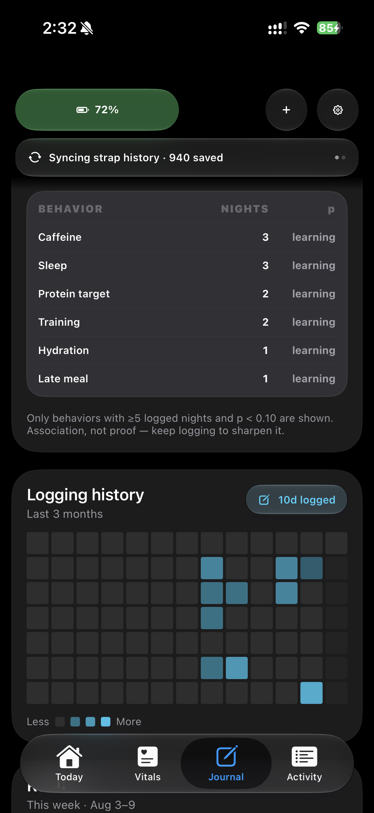
  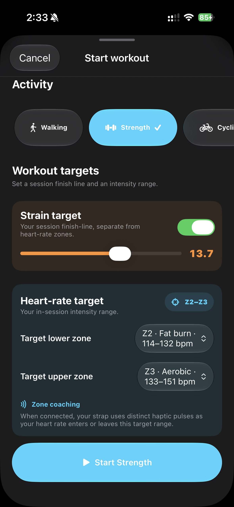
  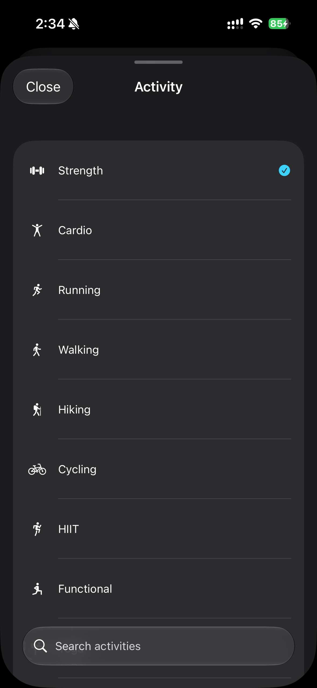
  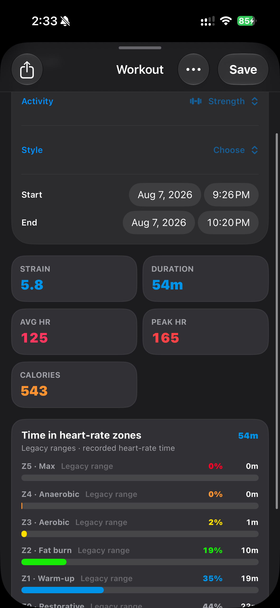
  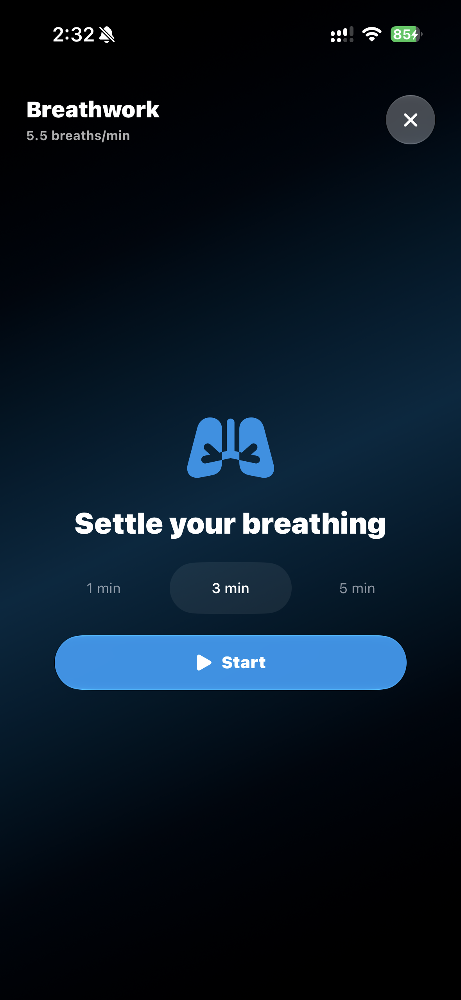
  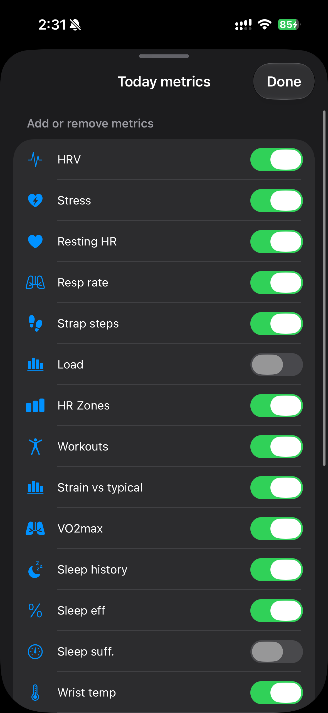
</p>
</details>

## What you get

| | |
|---|---|
| ❤️ **Live heart rate** | All day, in the app, widgets, Live Activity and Dynamic Island |
| 😴 **Sleep** | Detected nights and naps, stages as a labelled estimate, sleep need and debt |
| 🔋 **Recovery & HRV** | From your own overnight baselines, never population guesses |
| 🔥 **Strain & workouts** | Heart-rate-based strain; possible workouts to review in one tap |
| 👣 **Steps** | Counted from the strap's own motion sensor, even with the phone locked |
| 🌡️ **Skin temperature** | Night-to-night change from your own baseline |
| 🧠 **Coach** | Answers from your data, written by Apple's on-device model; nothing leaves the phone |
| 🔄 **Catch-up** | Pulls the strap's stored history after time away from the phone |
| 🔒 **Local only** | Backups and HealthKit export stay under your control |

## How accurate is it?

Every number is being checked against a trusted reference, one metric at a
time: a known truth, a fixed test, repeats, and a pass bar written down before
any data ([validation plan](docs/METRIC_VALIDATION_PLAN.md)).

**First one done: steps.** Walking to a sample-exact metronome, one step per click, on a real iPhone:

| Test | Steps taken | Atria counted |
|---|---:|---:|
| 100 per minute | 100 | 95 |
| 80 per minute | 80 | 80 |
| 120 per minute | 120 | 107 |
| Phone locked in a pocket | 100 | 100 |
| Two minutes typing at a desk | 0 | ≈ 0 |

Most of the gap is human reaction time at the first and last click ([#21](https://github.com/adidshaft/atria/issues/21)).

<details>
<summary><b>Where everything else stands</b></summary>
<br>

✅ Validated · 🟡 Works, not yet checked against a reference · 🔬 Research · ⛔ Blocked

| Capability | Today | Next |
|---|---|---|
| Live HR, battery & local storage | 🟡 Works on device; reference check pending | [#51](https://github.com/adidshaft/atria/issues/51) · [#23](https://github.com/adidshaft/atria/issues/23) |
| HRV & recovery | 🟡 Personal baseline | [#52](https://github.com/adidshaft/atria/issues/52) · [#58](https://github.com/adidshaft/atria/issues/58) · [#47](https://github.com/adidshaft/atria/issues/47) |
| Strain & heart-rate zones | 🟡 Local estimate | [#59](https://github.com/adidshaft/atria/issues/59) |
| Sleep detection & stages | 🟡 Works; stages are labelled estimates | [#55](https://github.com/adidshaft/atria/issues/55) · [#56](https://github.com/adidshaft/atria/issues/56) |
| Detected workouts | 🟡 Review-first, motion-gated | [#65](https://github.com/adidshaft/atria/issues/65) |
| Steps | ✅ Walks validated; whole-day totals pending | [#21](https://github.com/adidshaft/atria/issues/21) |
| Catch-up after time away | 🟡 Works on iPhone; long-gap proof pending | [#46](https://github.com/adidshaft/atria/issues/46) |
| Skin temperature | 🟡 Relative to your baseline only | [#61](https://github.com/adidshaft/atria/issues/61) |
| Blood oxygen | 🔬 Hidden until a real match is found | [#62](https://github.com/adidshaft/atria/issues/62) |
| HealthKit | 🟡 HR, workouts, sleep; HRV export gated | [#6](https://github.com/adidshaft/atria/issues/6) |
| Release | ⛔ Needs a non-beta macOS build machine | [#42](https://github.com/adidshaft/atria/issues/42) · [#44](https://github.com/adidshaft/atria/issues/44) |

Full detail: [current status](docs/CURRENT_STATUS.md).
</details>

## Help make Atria accurate

Atria is built by one person with **just a WHOOP 4.0 and an iPhone**: no chest
strap, no watch or ring, no WHOOP membership, no pulse oximeter. Every
accuracy check that needs one of those is waiting for someone who has it.

**If you own any of these, you can move a metric from "estimate" to "validated":**

| You have | You can validate | Start here |
|---|---|---|
| 🫀 A chest strap (Polar H10, Garmin HRM, Wahoo, Coros, Suunto) | Heart rate, HRV, resting HR, strain, calories | [#66](https://github.com/adidshaft/atria/issues/66) |
| ⌚ A watch or ring (Apple Watch, Oura, Garmin, Samsung, Pixel/Fitbit, Ultrahuman, RingConn) | Sleep timing & stages, breathing rate, skin temperature, VO2max | [#67](https://github.com/adidshaft/atria/issues/67) |
| 💪 An active WHOOP membership | Recovery and strain against WHOOP's own numbers | [#68](https://github.com/adidshaft/atria/issues/68) |
| 🩸 An overnight pulse oximeter (Wellue O2Ring, Masimo, Nonin) | Blood oxygen | [#69](https://github.com/adidshaft/atria/issues/69) |
| 📝 Nothing but 2–3 weeks of a one-line diary | Sleep timing, recovery direction, workouts, whole-day steps | [#70](https://github.com/adidshaft/atria/issues/70) |

**How it works**

1. **Run Atria** on your iPhone with a WHOOP 4.0 (see [Quick start](#quick-start)).
2. **Wear your device at the same time** and follow the procedure in the issue.
3. **Score it** with the scripts in [`tools/validation`](tools/validation/README.md).
4. **Post the summary** in the issue: device, sessions, error, pass or fail.
   Your raw data stays on your machine.
5. **Found a miss?** Fix it in a PR on `dev`. It has to hold on every repeat and
   work for everyone (no constants tuned to one person), with a test.

<details>
<summary><b>All 16 metric checks</b></summary>
<br>

| Metric | Reference | Issue |
|---|---|---|
| Heart rate | Chest strap | [#51](https://github.com/adidshaft/atria/issues/51) |
| RR intervals & HRV | Chest strap with RR | [#52](https://github.com/adidshaft/atria/issues/52) |
| Resting heart rate | Chest strap; watch or ring | [#53](https://github.com/adidshaft/atria/issues/53) |
| Respiratory rate | Paced breathing (no device) | [#54](https://github.com/adidshaft/atria/issues/54) |
| Sleep onset, wake & naps | Diary; watch, ring or bed sensor | [#55](https://github.com/adidshaft/atria/issues/55) |
| Sleep stages | Watch or ring (agreement); EEG or PSG | [#56](https://github.com/adidshaft/atria/issues/56) |
| Sleep need & consistency | Diary (arithmetic) | [#57](https://github.com/adidshaft/atria/issues/57) |
| Recovery | WHOOP app; known hard/easy days | [#58](https://github.com/adidshaft/atria/issues/58) |
| Strain, zones, max HR | Chest strap; WHOOP app | [#59](https://github.com/adidshaft/atria/issues/59) |
| Stress | Labelled session (no device) | [#60](https://github.com/adidshaft/atria/issues/60) |
| Skin temperature | Watch or ring temperature | [#61](https://github.com/adidshaft/atria/issues/61) |
| Blood oxygen | Overnight oximeter | [#62](https://github.com/adidshaft/atria/issues/62) |
| VO2max | Watch VO2max or a lab test | [#63](https://github.com/adidshaft/atria/issues/63) |
| Active calories | Watch active energy | [#64](https://github.com/adidshaft/atria/issues/64) |
| Detected workouts | Workout diary | [#65](https://github.com/adidshaft/atria/issues/65) |
| Steps (whole day) | Phone pedometer | [#21](https://github.com/adidshaft/atria/issues/21) |
</details>

## Quick start

You need a Mac with Xcode, an iPhone on iOS 26.1+ (Bluetooth can't be tested in
the Simulator), and a WHOOP 4.0 that isn't connected to the WHOOP app.

```sh
git clone https://github.com/adidshaft/atria.git
open atria/Atria/Atria.xcodeproj
```

Pick the **Atria** target and your iPhone, set your signing team, and press Run.
The app walks you through pairing the strap. No strap yet? Tap **Explore sample
data** on the welcome screen.

Stuck? [`docs/SETUP.md`](docs/SETUP.md) covers signing, logs and the common errors.

<details>
<summary><b>Developer tooling</b></summary>
<br>

Physical-device log harness:

```sh
ATRIA_DEVICE_ID="YOUR-PHYSICAL-DEVICE-ID" ./live_device_debug.sh --seconds 45 --log logs/live-device/run.log --log-gate-status --standard-hr-only --long-wear-mode --leave-running
```

Offline checks (known failures tracked in [#44](https://github.com/adidshaft/atria/issues/44)):

```sh
./test_handoff_local.sh
```

Overnight long-wear monitor (non-invasive; samples without relaunching Atria):

```sh
ATRIA_DEVICE_ID="YOUR-PHYSICAL-DEVICE-ID" python3 tools/monitor_long_wear.py --preset overnight --label overnight-$(date -u +%Y%m%dT%H%M%SZ)
```

Accessibility and scroll-performance evidence: `tools/capture_accessibility_visual_evidence.sh`,
`tools/capture_dashboard_scroll_performance.sh`, then
`tools/prepare_accessibility_performance_evidence.py`. Summarise handoff evidence with
`python3 tools/audit_handoff_status.py --skip-external-reference`.

| Path | What's there |
|---|---|
| `Atria/` | SwiftUI app, widgets, HealthKit, Bluetooth and metrics |
| `tools/validation/` | Accuracy validation: data pull, chest-strap recorder, scorer |
| `tools/strap-mac/` | Mac Bluetooth research: protocol captures, metronome |
| `tools/` | Analysis helpers for captures and evidence |
| `docs/` | Protocol research, plans and status — start at [`docs/README.md`](docs/README.md) |
| `evidence/` | Device evidence. Gitignored: may contain personal health data |
</details>

## Not there yet

- **Clinically validated HRV and recovery.** Both run on your personal baseline
  until a chest-strap check passes ([#52](https://github.com/adidshaft/atria/issues/52)).
- **WHOOP-specific RR scaling.** A unit question is still open ([#47](https://github.com/adidshaft/atria/issues/47)).
- **Blood oxygen.** Stays hidden: the obvious strap fields give a constant, not
  a reading ([#62](https://github.com/adidshaft/atria/issues/62)).
- **Absolute skin temperature.** Shown only as change from your own baseline.
- **Anything from WHOOP's cloud.** Atria stays local by design.

## Principles

- **Local first.** No account, no cloud, no subscription.
- **No fake numbers.** A metric shows what was measured, or waits; it never
  invents a value to fill a tile.
- **Built for everyone.** Calibrations are per-person or self-calibrating,
  never tuned to one wearer.
- **Tested on real hardware.** Bluetooth work counts only on a physical iPhone.

## Contributing

Work lands on **`dev`**; reviewed changes reach **`main`** through the
integration PR. Read [CONTRIBUTING.md](CONTRIBUTING.md), then pick an
[open issue](https://github.com/adidshaft/atria/issues). They are labelled by
area and by what they wait on (`needs: reference`, `needs: device proof`,
`help wanted: reference device`). Accuracy help is the most valuable
contribution right now: see [Help make Atria accurate](#help-make-atria-accurate).

## Privacy and safety

Atria keeps your data on your phone. Logs and evidence files can contain
timestamps, heart rate, sleep and device names, so review them before sharing.
Atria is a personal-fitness and research project, not a medical device. Don't
use it for diagnosis, treatment or safety decisions.

## License

Dual licensed under [MIT](LICENSE) or [Apache-2.0](LICENSE-APACHE).
